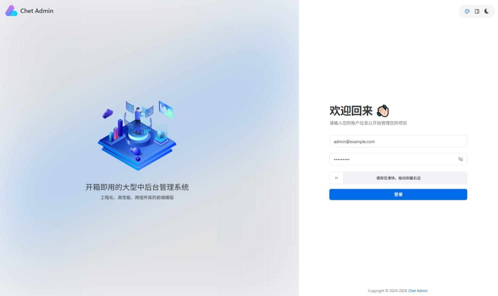
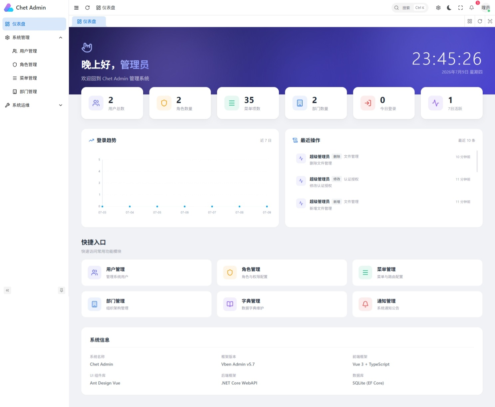
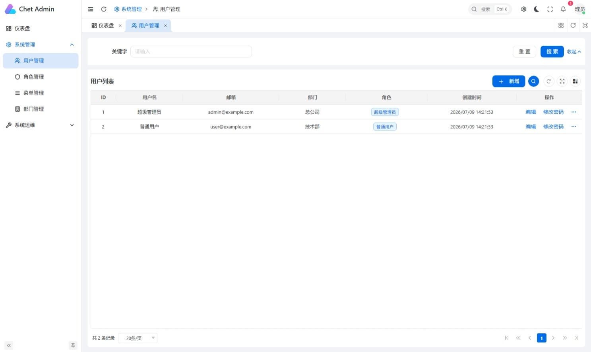
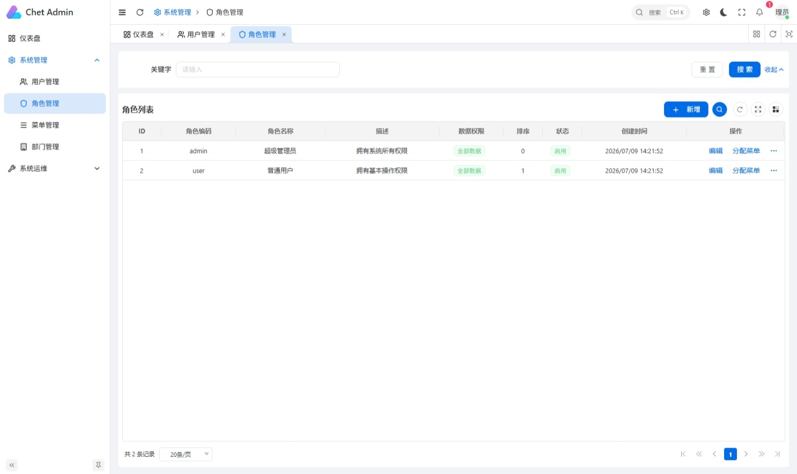
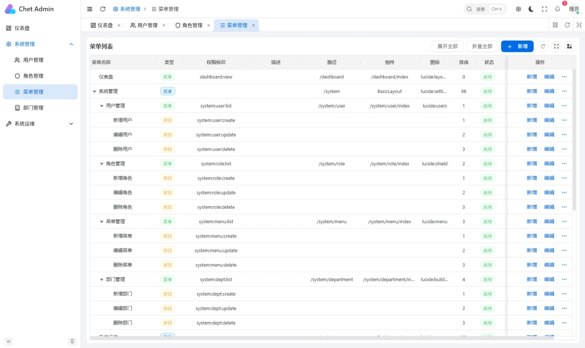
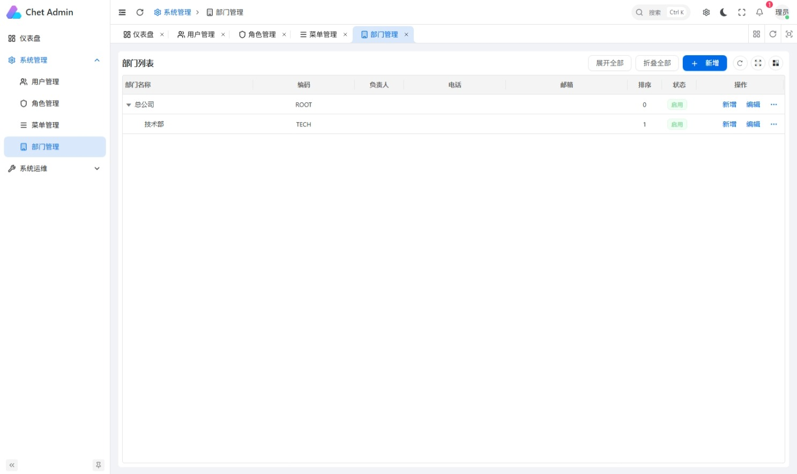
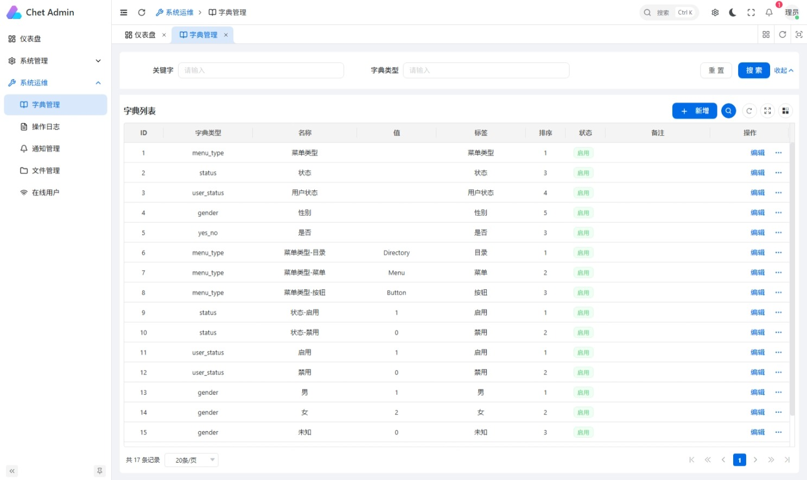
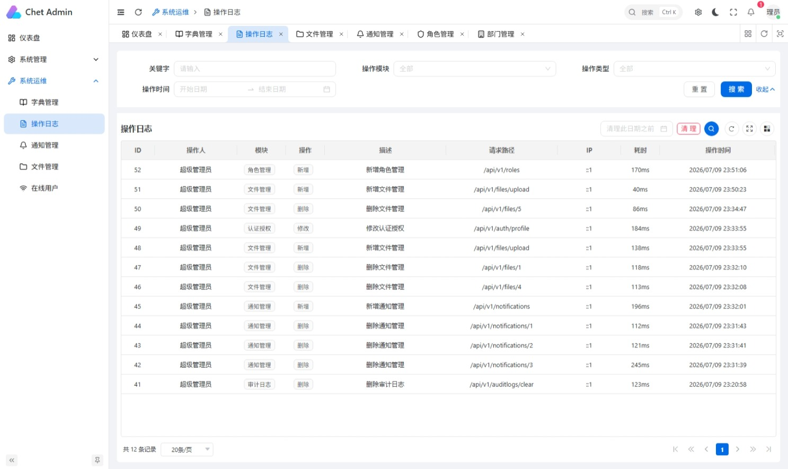
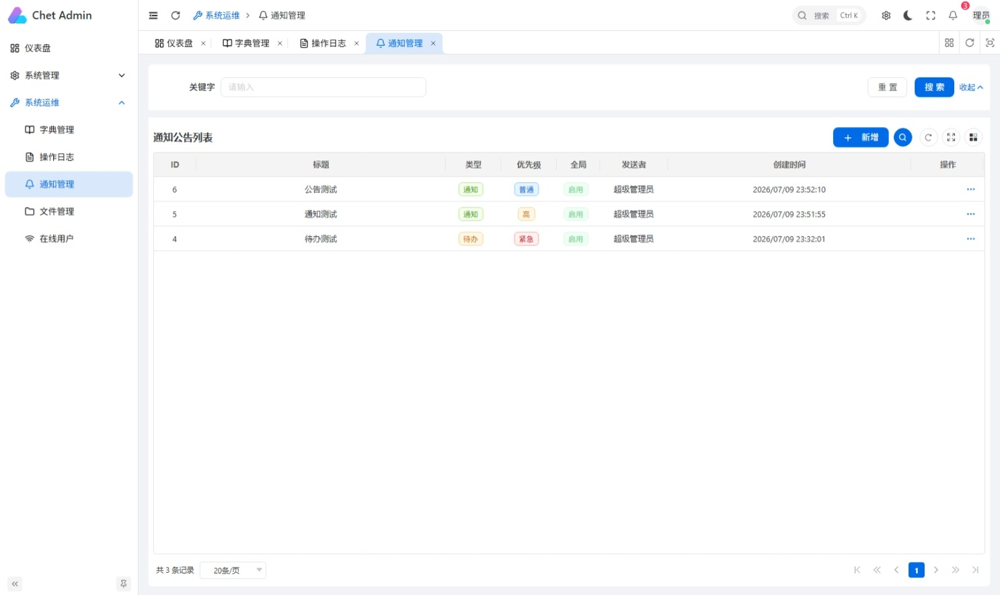

# Chet.Admin

<p align="center">
  <strong>基于 .NET 10 + Vue 3 的企业级 RBAC 权限管理系统</strong>
</p>

<p align="center">
  
  
  
  
  
  
</p>

<p align="center">
  <a href="#快速开始">快速开始</a> ·
  <a href="./docs/README.md">完整文档</a> ·
  <a href="#功能预览">功能预览</a> ·
  <a href="#项目结构">项目结构</a>
</p>

---

## 项目简介

**Chet.Admin** 是一套采用前后端分离架构的企业级 RBAC（基于角色的访问控制）权限管理系统，开箱即用，提供完整的用户、角色、菜单、部门、权限等核心能力，以及按钮级权限控制、行级数据权限、操作审计、通知公告等增强功能。

- **后端**：基于 .NET 10 的 Clean Architecture 解决方案，遵循 DDD 领域驱动设计
- **前端**：基于 [Vben Admin v5.7](https://vben.pro) 框架的 Vue 3 管理后台（Ant Design Vue 技术栈）

## 功能预览

> 📌 以下为系统界面截图（请在 `docs/screenshots/` 目录放置对应图片）：

### 登录页



### 仪表盘



### 用户管理



### 角色管理



### 菜单管理



### 部门管理



### 权限管理


### 字典管理



### 操作日志



### 通知公告



### 在线用户


### 个人中心


## 核心特性

- 🚀 **现代化技术栈**：.NET 10 + Vue 3 + TypeScript + Vite
- 🏗️ **企业级架构**：后端 Clean Architecture + DDD，前端 Monorepo（pnpm + Turbo）
- 🔐 **完善权限体系**：菜单级路由权限 + 按钮级操作权限 + 行级数据权限（5 种范围）
- 🔒 **安全可靠**：JWT 双令牌认证、BCrypt 密码哈希、限流防护、验证码、登录锁定、密码过期策略
- 📊 **可观测性**：Serilog 结构化日志、操作审计日志、在线用户追踪
- 🌐 **开箱即用**：内置种子数据，启动即可登录使用
- 🐳 **容器化部署**：原生支持 Docker / Docker Compose
- 🎨 **现代化 UI**：基于 Ant Design Vue，支持浅色 / 深色主题

## 技术栈

### 后端

| 类别 | 技术 |
| ---- | ---- |
| 框架 | .NET 10 + C# 12 |
| ORM | Entity Framework Core（SQLite / PostgreSQL） |
| 缓存 | Redis + MemoryCache（支持 NoOp 降级） |
| 认证 | JWT（双令牌机制） |
| 密码 | BCrypt 哈希 |
| 对象映射 | AutoMapper |
| 日志 | Serilog（结构化日志） |
| API 文档 | Swagger / OpenAPI |
| 参数校验 | FluentValidation |

### 前端

| 类别 | 技术 |
| ---- | ---- |
| 框架 | Vue 3（Composition API） |
| 构建工具 | Vite |
| UI 组件库 | Ant Design Vue |
| 语言 | TypeScript |
| 状态管理 | Pinia |
| 路由 | Vue Router（动态路由权限） |
| CSS 方案 | Tailwind CSS v4 |
| 包管理 | pnpm（Monorepo） |
| 表格组件 | VxeTable |
| 图表 | ECharts（vue-echarts） |

## 功能模块

| 模块 | 完成度 | 说明 |
| ---- | ---- | ---- |
| 认证登录 | 90% | 注册、登录、刷新令牌、验证码、登录锁定、密码过期策略 |
| 用户管理 | 95% | CRUD、密码强度、分配角色、数据权限过滤 |
| 角色管理 | 95% | CRUD、权限分配、菜单分配、5 种数据权限范围 |
| 菜单管理 | 90% | 树形 CRUD、动态路由生成、目录/菜单/按钮 |
| 部门管理 | 90% | 树形 CRUD、组织架构 |
| 权限管理 | 85% | CRUD、按钮级权限码 |
| 字典管理 | 85% | CRUD、`useDict` 联动业务表单 |
| 仪表盘 | 85% | 统计卡片、SVG 趋势图、最近操作 |
| 操作日志 | 90% | 中间件自动记录、分页查询、清理 |
| 通知公告 | 85% | 全局公告、个人通知、未读计数 |
| 文件上传 | 80% | 本地存储、上传/下载/删除 |
| 在线用户 | 85% | 登录追踪、强制下线 |
| 个人中心 | 85% | 资料修改、密码修改、头像上传 |

## 快速开始

### 环境要求

| 环境 | 版本 |
| ---- | ---- |
| .NET SDK | 10.0+ |
| Node.js | 22.18+ 或 24+ |
| pnpm | 11.0+ |

### 启动后端

```bash
cd Chet.Admin.Api
dotnet restore
dotnet run --project Chet.Admin.Api
```

后端运行在 **http://localhost:5000**，Swagger UI：**http://localhost:5000/swagger**

### 启动前端

```bash
cd Chet.Admin.Web
pnpm install
pnpm dev:antd
```

前端运行在 **http://localhost:5666**，自动代理 `/api` 请求到后端。

### 默认账号

| 项目 | 值 |
| ---- | ---- |
| 邮箱 | `admin@example.com` |
| 密码 | `Admin@123` |

> 首次登录如遇异常，按 `Ctrl+Shift+Delete` 清除浏览器 localStorage 后重试。

## 项目结构

```
Chet.Admin/
├── Chet.Admin.Api/                    # 后端 .NET 10 解决方案（Clean Architecture）
│   ├── Chet.Admin.Api/                # 表示层：控制器、中间件、启动配置
│   ├── Chet.Admin.Application/        # 应用层：业务服务、对象映射
│   │   ├── Chet.Admin.Services/       # 业务逻辑实现
│   │   └── Chet.Admin.Mapping/        # AutoMapper 配置
│   ├── Chet.Admin.Core/               # 核心层（不依赖任何其他层）
│   │   ├── Chet.Admin.Domain/         # 领域实体
│   │   ├── Chet.Admin.Contracts/      # 接口契约
│   │   └── Chet.Admin.Shared/         # 共享类、异常、响应模型
│   ├── Chet.Admin.Infrastructure/     # 基础设施层
│   │   ├── Chet.Admin.Data/           # EF Core 数据访问
│   │   ├── Chet.Admin.Caching/        # Redis / NoOp 缓存
│   │   ├── Chet.Admin.Configuration/  # 强类型配置
│   │   └── Chet.Admin.Logging/        # 日志配置
│   ├── Chet.Admin.Tests/              # 测试层
│   └── docker-compose.yml
├── Chet.Admin.Web/                    # 前端 Vben Admin 5.7 Monorepo
│   └── apps/
│       └── web-antd/                 # 主应用（Ant Design Vue）
│           └── src/
│               ├── api/              # API 请求层
│               ├── views/            # 页面（dashboard/system/_core）
│               ├── store/            # Pinia 状态管理
│               ├── router/           # 动态路由 + 权限守卫
│               └── composables/      # 组合式函数（useDict 等）
└── docs/                              # 项目文档
```

## 文档

完整文档位于 [`docs/`](./docs/README.md) 目录：

| 文档 | 说明 |
| ---- | ---- |
| [01-项目概述](./docs/01-项目概述.md) | 项目简介、技术栈、功能模块 |
| [02-系统架构](./docs/02-系统架构.md) | 前后端架构、目录结构、依赖关系 |
| [03-快速开始](./docs/03-快速开始.md) | 环境搭建、启动步骤、联调说明 |
| [04-后端开发指南](./docs/04-后端开发指南.md) | 分层详解、DI 约定、新增模块流程 |
| [05-前端开发指南](./docs/05-前端开发指南.md) | 目录规范、页面结构、权限控制 |
| [06-API 接口文档](./docs/06-API接口文档.md) | 统一响应格式、认证机制、接口清单 |
| [07-数据库设计](./docs/07-数据库设计.md) | RBAC 模型、ER 图、数据表结构 |
| [08-部署指南](./docs/08-部署指南.md) | Docker 部署、Nginx 配置、生产清单 |
| [09-功能模块说明](./docs/09-功能模块说明.md) | 各模块功能、接口、实现细节 |

更多后端设计文档见 [`Chet.Admin.Api/.docs/`](./Chet.Admin.Api/.docs/) 与 [`Chet.Admin.Api/NEW_FEATURES_DESIGN.md`](./Chet.Admin.Api/NEW_FEATURES_DESIGN.md)。

## 部署

### Docker Compose（推荐）

```bash
cd Chet.Admin.Api
docker-compose up -d --build

# 同时启动 Redis
docker-compose --profile with-redis up -d --build
```

### 前端构建

```bash
cd Chet.Admin.Web
pnpm install
pnpm build:antd
```

构建产物位于 `apps/web-antd/dist`，部署到 Nginx 静态目录并配置 API 反向代理。

详见 [部署指南](./docs/08-部署指南.md)。

## 开发指南

### 后端新增业务模块

按层依次添加：领域实体 → 接口契约 → 仓储实现 → 服务实现 → 控制器 → DI 注册 → 数据库迁移。

详见 [后端开发指南](./docs/04-后端开发指南.md#8-新增业务模块流程)。

### 前端新增页面

```
1. 新增 API 文件：src/api/system/{module}.ts
2. 新增页面：src/views/system/{module}/index.vue
3. 新增路由模块：src/router/routes/modules/{module}.ts（或后端菜单动态返回）
4. 后端配置权限码，前端按钮绑定权限码
```

详见 [前端开发指南](./docs/05-前端开发指南.md#12-新增业务模块完整流程)。

## 截图说明

本文档预留的截图位置对应 `docs/screenshots/` 目录下的图片文件，请按以下命名放置：

| 文件名 | 对应章节 |
| ---- | ---- |
| `login.png` | 登录页 |
| `dashboard.png` | 仪表盘 |
| `user.png` | 用户管理 |
| `role.png` | 角色管理 |
| `menu.png` | 菜单管理 |
| `department.png` | 部门管理 |
| `permission.png` | 权限管理 |
| `dictionary.png` | 字典管理 |
| `audit-log.png` | 操作日志 |
| `notification.png` | 通知公告 |
| `online-user.png` | 在线用户 |
| `profile.png` | 个人中心 |

截图建议尺寸：宽度 1920px，PNG 格式，可通过浏览器 F12 → 设备工具栏 → 1280×800 截图后裁剪。

## 开源致谢

- 后端架构参考：[Clean Architecture](https://learn.microsoft.com/dotnet/architecture/modern-web-apps-azure/common-web-application-architectures)
- 前端框架：[Vue Vben Admin](https://github.com/vbenjs/vue-vben-admin)（MIT 协议）
- UI 组件库：[Ant Design Vue](https://antdv.com/)

## License

本项目采用 [MIT](./LICENSE) 协议。
